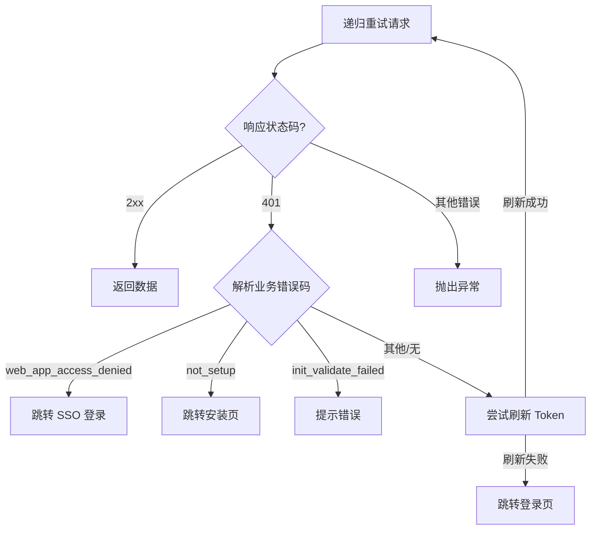

# 接口 API 请求封装详解

`web/service` 目录下的核心封装主要集中在 `fetch.ts` 和 `base.ts` 两个文件中。`fetch.ts` 负责底层的 HTTP 协议适配，而 `base.ts` 则在此基础上构建了面向业务的请求逻辑，特别是复杂的流式交互和错误恢复机制。

## 1. 核心文件职责

| 文件名 | 职责描述 |
| :--- | :--- |
| **`fetch.ts`** | **底层 HTTP 客户端封装**。<br>基于 `ky` 库，提供统一的拦截器（Hooks）、超时配置、Header 注入（CSRF, ShareCode）以及基础的响应体解析（JSON/Blob）。 |
| **`base.ts`** | **业务层请求封装**。<br>核心功能包括：<br>1. **流式响应 (SSE)**：处理打字机效果、Agent 思考、工作流事件等。<br>2. **错误恢复**：Token 过期自动刷新并重试请求。<br>3. **业务路由**：根据错误码自动跳转登录、SSO 或安装页。 |

## 2. HTTP 请求封装 (`fetch.ts`)

### 2.1 基础配置
- **客户端实例**：使用 `ky.create` 创建，默认超时时间为 `100s`。
- **动态前缀**：`base` 函数根据参数动态选择 API 前缀：
  - 默认：`/console/api` (`API_PREFIX`)
  - 公开应用：`/api` (`PUBLIC_API_PREFIX`)
  - 插件市场：`/marketplace-api` (`MARKETPLACE_API_PREFIX`)

### 2.2 关键拦截器 (Hooks)

#### `beforeRequest`: 请求前置处理
主要用于身份认证和上下文注入：
```typescript
// 伪代码逻辑
if (isPublicAPI) {
  // 1. 注入 Bearer Token
  if (accessToken) request.headers.set('Authorization', `Bearer ${accessToken}`)
  
  // 2. 注入分享码上下文 (Share Code)
  const shareCode = resolveShareCode()
  if (shareCode) {
    request.headers.set('X-Share-Code', shareCode)
    request.headers.set('X-Passport-Code', getPassport(shareCode))
  }
}
```

#### `afterResponseErrorCode`: 响应错误拦截
在响应返回但状态码非 2xx/3xx 时触发：
1.  **403 Forbidden**: 
    - 如果错误码是 `already_setup`，跳转至 `/signin`。
    - 否则显示 Toast 错误提示。
2.  **401 Unauthorized**: 
    - **直接抛出异常**。这一步非常关键，它将 401 错误透传给上层 (`base.ts`)，由上层决定是否进行 Token 刷新和重试。
3.  **其他错误**: 显示 Toast 提示并抛出。

## 3. 业务请求包装 (`base.ts`)

### 3.1 智能错误恢复流程 (`request` 函数)

这是所有非流式请求的入口。它实现了一套复杂的错误处理状态机，确保用户会话的连续性。



### 3.2 SSE 流式请求封装

针对 LLM 对话场景，`base.ts` 提供了 `ssePost` 和 `handleStream` 来处理 Server-Sent Events。

#### 核心解析逻辑 (`handleStream`)
该函数解决了 SSE 数据流常见的**粘包**和**跨包**问题。

```typescript
// 核心代码摘要
const decoder = new TextDecoder('utf-8')
let buffer = ''

function read() {
  reader.read().then((result) => {
    // 1. 解码并追加到缓冲区
    buffer += decoder.decode(result.value, { stream: true })
    // 2. 按行分割
    const lines = buffer.split('\n')
    
    // 3. 处理完整的行
    lines.forEach((message) => {
      if (message.startsWith('data: ')) {
        try {
          // 解析 JSON
          const bufferObj = JSON.parse(message.substring(6))
          // 分发事件...
        } catch {
          // 忽略解析失败（可能是数据未接收完）
        }
      }
    })
    
    // 4. 关键：保留最后一行（可能是半截数据）到下一次循环处理
    buffer = lines[lines.length - 1]
    
    if (!done) read() // 递归读取下一块
  })
}
```

#### SSE 事件字典
前端通过 `event` 字段区分消息类型，支持的回调十分丰富：

| 事件 (event) | 回调函数 (Interface) | 说明 |
| :--- | :--- | :--- |
| **基础消息** | | |
| `message` / `agent_message` | `onData` | 核心对话文本，增量返回 |
| `message_end` | `onMessageEnd` | 消息生成结束，包含 metadata |
| `message_replace` | `onMessageReplace` | 消息内容被替换 |
| `message_file` | `onFile` | 生成的文件（如图片） |
| **Agent 推理** | | |
| `agent_thought` | `onThought` | Agent 的思考过程（CoT） |
| `agent_log` | `onAgentLog` | Agent 运行日志 |
| **工作流 (Workflow)** | | |
| `workflow_started` | `onWorkflowStarted` | 工作流开始 |
| `workflow_finished` | `onWorkflowFinished` | 工作流结束 |
| `node_started` | `onNodeStarted` | 节点开始运行 |
| `node_finished` | `onNodeFinished` | 节点运行结束 |
| **复杂逻辑控制** | | |
| `iteration_*` | `onIteration*` | 迭代器节点事件 |
| `loop_*` | `onLoop*` | 循环节点事件 |
| `parallel_branch_*` | `onParallelBranch*` | 并行分支事件 |
| **多模态** | | |
| `tts_message` | `onTTSChunk` | 语音合成数据块 |
| `tts_message_end` | `onTTSEnd` | 语音合成结束 |

## 4. 文件上传 (`upload`)

虽然大部分请求使用 `ky` (fetch)，但文件上传为了支持**进度监控** (`onprogress`)，回退到了原生的 `XMLHttpRequest` 实现。

- **功能**：支持上传进度回调，这对大文件上传的用户体验至关重要。
- **安全**：同样会自动注入 CSRF Token、Passport 和 ShareCode。
