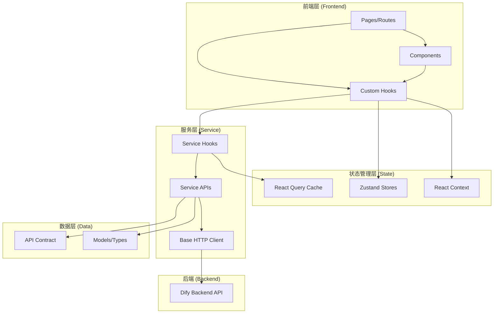
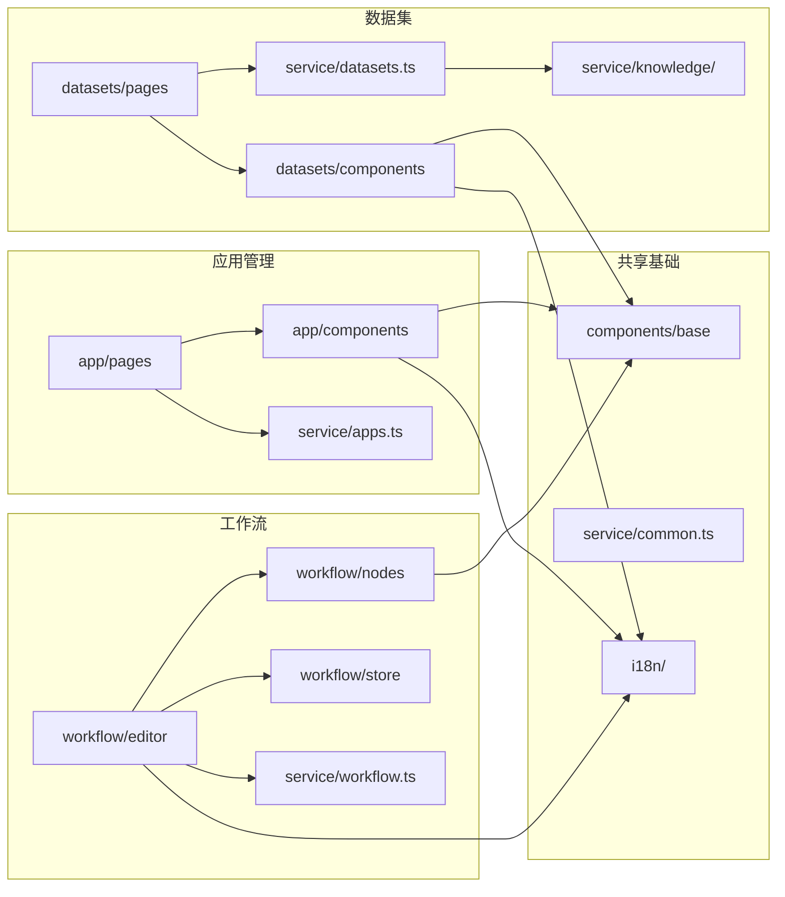
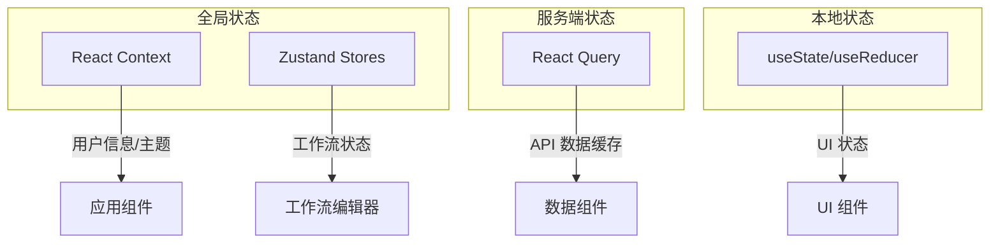
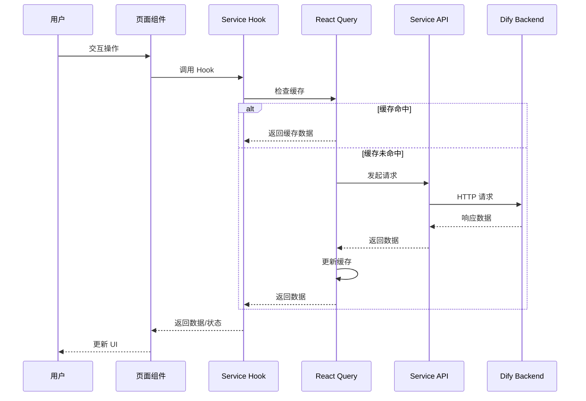

# Dify Web 项目架构文档

## 1. 项目概述

| 属性 | 值 |
|------|-----|
| 项目名称 | dify-web |
| 版本 | 1.11.4 |
| 框架 | Next.js 15.5.9 + React 19.2.3 |
| 包管理器 | pnpm 10.27.0 |
| 语言 | TypeScript |
| 样式方案 | Tailwind CSS |
| 状态管理 | Zustand + React Query |
| 部署方式 | Docker Standalone |

---

## 2. 目录结构总览

```
dify-web/
├── app/                    # Next.js App Router 路由和页面
├── service/                # API 服务层（数据获取）
├── models/                 # 数据模型和类型定义
├── types/                  # TypeScript 类型定义
├── context/                # React Context 全局状态
├── hooks/                  # 自定义 React Hooks
├── config/                 # 配置文件
├── contract/               # API 契约定义
├── i18n/                   # 国际化翻译（22种语言）
├── public/                 # 静态资源
├── assets/                 # SVG 图标等资源
├── themes/                 # 主题配置
├── scripts/                # 构建脚本
├── docker/                 # Docker 配置
└── __tests__/              # 测试文件
```

---

## 3. 功能域划分

项目按以下核心功能域组织：

| 功能域 | 描述 | 路由前缀 |
|--------|------|----------|
| **应用管理 (App)** | 创建、配置、发布 AI 应用 | `/app`, `/apps` |
| **数据集 (Dataset)** | 知识库管理、文档处理 | `/datasets` |
| **工作流 (Workflow)** | 可视化流程编排 | `/app/[id]/workflow` |
| **探索市场 (Explore)** | 应用模板和市场 | `/explore` |
| **插件 (Plugins)** | 插件安装和管理 | `/plugins` |
| **工具 (Tools)** | 自定义工具管理 | `/tools` |
| **账户 (Account)** | 用户设置和认证 | `/account`, `/signin` |
| **分享 (Share)** | 应用公开分享 | `/chat`, `/chatbot`, `/workflow` |

---

## 4. 模块依赖关系图

### 4.1 整体架构依赖



### 4.2 功能域模块依赖



---

## 5. app/ 目录详细结构

### 5.1 路由组织（Route Groups）

```
app/
├── (commonLayout)/           # 主应用布局（带侧边栏）
│   ├── layout.tsx            # 主布局组件
│   ├── app/                  # 应用管理
│   ├── apps/                 # 应用列表
│   ├── datasets/             # 数据集管理
│   ├── explore/              # 应用探索
│   ├── plugins/              # 插件管理
│   └── tools/                # 工具管理
│
├── (shareLayout)/            # 分享布局（无侧边栏）
│   ├── layout.tsx            # 分享布局组件
│   ├── chat/[token]/         # 聊天分享
│   ├── chatbot/[token]/      # 机器人分享
│   ├── completion/[token]/   # 完成任务分享
│   └── workflow/[token]/     # 工作流分享
│
├── account/                  # 账户管理
├── signin/                   # 登录
├── signup/                   # 注册
└── components/               # 页面级组件库
```

### 5.2 应用管理模块 (App)

```
app/(commonLayout)/app/
├── page.tsx                          # 应用列表页
└── (appDetailLayout)/[appId]/        # 应用详情
    ├── layout.tsx                    # 详情布局
    ├── overview/                     # 概览页
    │   └── tracing/                  # 追踪配置
    ├── configuration/                # 应用配置
    ├── develop/                      # API 开发
    ├── logs/                         # 运行日志
    ├── annotations/                  # 标注管理
    └── workflow/                     # 工作流编辑器
```

**对应 Service 层：**
- `service/apps.ts` - 应用 CRUD API
- `service/use-apps.ts` - 应用数据 Hooks
- `service/log.ts` - 日志 API
- `service/annotation.ts` - 标注 API

### 5.3 数据集模块 (Dataset)

```
app/(commonLayout)/datasets/
├── page.tsx                          # 数据集列表
├── create/                           # 创建数据集
├── connect/                          # 连接数据源
├── create-from-pipeline/             # 从管道创建
└── (datasetDetailLayout)/[datasetId]/
    ├── layout.tsx                    # 详情布局
    ├── documents/                    # 文档管理
    │   └── [documentId]/             # 文档详情
    ├── hitTesting/                   # 命中测试
    ├── settings/                     # 数据集设置
    ├── pipeline/                     # 管道配置
    └── api/                          # API 管理
```

**对应 Service 层：**
- `service/datasets.ts` - 数据集 CRUD API
- `service/knowledge/` - 知识库相关 Hooks
  - `use-dataset.ts` - 数据集操作
  - `use-document.ts` - 文档操作
  - `use-segment.ts` - 分段管理
  - `use-hit-testing.ts` - 命中测试
  - `use-metadata.ts` - 元数据管理

### 5.4 工作流模块 (Workflow)

```
app/components/workflow/
├── index.tsx                 # 工作流编辑器入口
├── store/                    # Zustand 状态管理
├── hooks/                    # 工作流 Hooks
├── nodes/                    # 节点类型（30+种）
│   ├── _base/                # 基础节点组件
│   ├── start/                # 开始节点
│   ├── end/                  # 结束节点
│   ├── llm/                  # LLM 节点
│   ├── knowledge-retrieval/  # 知识检索节点
│   ├── if-else/              # 条件分支节点
│   ├── code/                 # 代码执行节点
│   ├── http/                 # HTTP 请求节点
│   ├── tool/                 # 工具调用节点
│   ├── iteration/            # 迭代节点
│   ├── loop/                 # 循环节点
│   ├── agent/                # Agent 节点
│   └── ...                   # 更多节点类型
├── panel/                    # 侧边面板
│   ├── debug-and-preview/    # 调试预览
│   ├── version-history-panel/# 版本历史
│   ├── env-panel/            # 环境变量
│   └── global-variable-panel/# 全局变量
├── block-selector/           # 节点选择器
├── operator/                 # 画布操作器
└── utils/                    # 工具函数
```

**对应 Service 层：**
- `service/workflow.ts` - 工作流 API
- `service/use-workflow.ts` - 工作流 Hooks
- `service/debug.ts` - 调试 API

---

## 6. service/ 目录详细结构

### 6.1 服务层架构

```
service/
├── base.ts                   # HTTP 基础类（核心）
├── fetch.ts                  # Fetch 封装
├── client.ts                 # API 客户端配置
├── utils.ts                  # 工具函数
│
├── [domain].ts               # 领域 API 定义
├── use-[domain].ts           # 领域 React Hooks
│
└── knowledge/                # 知识库子模块
    └── use-*.ts              # 知识库相关 Hooks
```

### 6.2 按功能域分类

| 功能域 | API 文件 | Hooks 文件 | 说明 |
|--------|----------|------------|------|
| **应用** | `apps.ts` | `use-apps.ts` | 应用 CRUD |
| **数据集** | `datasets.ts` | `use-dataset-card.ts` | 数据集管理 |
| **知识库** | - | `knowledge/*.ts` | 文档、分段、检索 |
| **工作流** | `workflow.ts` | `use-workflow.ts` | 工作流编排 |
| **日志** | `log.ts` | `use-log.ts` | 运行日志 |
| **分享** | `share.ts` | `use-share.ts` | 应用分享 |
| **探索** | `explore.ts` | `use-explore.ts` | 应用市场 |
| **插件** | `plugins.ts` | `use-plugins.ts` | 插件管理 |
| **工具** | `tools.ts` | `use-tools.ts` | 工具管理 |
| **计费** | `billing.ts` | `use-billing.ts` | 订阅计费 |
| **通用** | `common.ts` | `use-common.ts` | 用户、工作区 |
| **认证** | `sso.ts`, `webapp-auth.ts` | `use-oauth.ts` | SSO/OAuth |

### 6.3 Service 层设计模式

```typescript
// 1. API 定义 (apps.ts)
export const fetchAppList = (params: AppListParams) => {
  return get<AppListResponse>('/apps', { params })
}

export const createApp = (data: CreateAppRequest) => {
  return post<App>('/apps', { body: data })
}

// 2. React Hooks (use-apps.ts)
export const useAppList = (params: AppListParams) => {
  return useQuery({
    queryKey: ['apps', params],
    queryFn: () => fetchAppList(params),
  })
}

export const useCreateApp = () => {
  return useMutation({
    mutationFn: createApp,
    onSuccess: () => {
      queryClient.invalidateQueries({ queryKey: ['apps'] })
    },
  })
}
```

---

## 7. components/ 目录详细结构

### 7.1 组件分层

```
app/components/
├── base/                     # 基础 UI 组件（102+个）
├── [domain]/                 # 领域业务组件
└── header/                   # 全局头部导航
```

### 7.2 基础组件库 (base/)

| 分类 | 组件 |
|------|------|
| **表单** | button, input, textarea, select, checkbox, radio, switch, slider, form |
| **反馈** | dialog, modal, drawer, popover, tooltip, toast, confirm |
| **数据展示** | badge, tag, chip, avatar, pagination, skeleton, progress-bar |
| **导航** | tab-header, tab-slider, segmented-control, dropdown |
| **编辑器** | prompt-editor, code-editor, markdown |
| **上传** | file-uploader, image-uploader |
| **媒体** | image-gallery, audio-gallery, video-gallery, qrcode |
| **图标** | icons, svg, logo, app-icon, emoji-picker |

### 7.3 领域组件

| 领域 | 目录 | 主要组件 |
|------|------|----------|
| **应用** | `app/` | configuration, log, overview, annotation |
| **数据集** | `datasets/` | create, documents, hit-testing, settings |
| **工作流** | `workflow/` | nodes, panel, block-selector, operator |
| **插件** | `plugins/` | marketplace, install-plugin, plugin-detail |
| **工具** | `tools/` | provider, setting, workflow-tool |
| **计费** | `billing/` | pricing, plan, upgrade-btn |
| **探索** | `explore/` | app-card, app-list, sidebar |

---

## 8. 状态管理架构

### 8.1 状态管理方案



### 8.2 Context 使用场景

| Context | 用途 | 位置 |
|---------|------|------|
| `AppContext` | 当前应用信息 | `context/app-context.tsx` |
| `I18nContext` | 国际化 | `context/i18n.tsx` |
| `ModalContext` | 全局模态框 | `context/modal-context.tsx` |
| `ToastContext` | 全局通知 | `context/toast-context.tsx` |

### 8.3 Zustand Store

| Store | 用途 | 位置 |
|-------|------|------|
| `workflowStore` | 工作流编辑器状态 | `app/components/workflow/store/` |
| `pipelineStore` | RAG 管道状态 | `app/components/rag-pipeline/store/` |

---

## 9. 数据流架构



---

## 10. 关键技术栈

### 10.1 核心依赖

| 类别 | 技术 | 版本 |
|------|------|------|
| **框架** | Next.js | 15.5.9 |
| **UI 库** | React | 19.2.3 |
| **语言** | TypeScript | 5.x |
| **样式** | Tailwind CSS | 3.x |
| **状态管理** | Zustand | 5.x |
| **数据获取** | @tanstack/react-query | 5.x |
| **图表** | ReactFlow | 11.x |
| **编辑器** | Monaco Editor | - |
| **Markdown** | react-markdown | - |
| **国际化** | i18next | - |

### 10.2 开发工具

| 工具 | 用途 |
|------|------|
| ESLint | 代码检查 |
| Prettier | 代码格式化 |
| Husky | Git Hooks |
| Storybook | 组件文档 |
| Jest | 单元测试 |

---

## 11. 路由映射表

| 路由 | 页面 | 功能 |
|------|------|------|
| `/` | 重定向 | → `/apps` |
| `/apps` | 应用列表 | 查看所有应用 |
| `/app/[id]/overview` | 应用概览 | 应用统计和配置 |
| `/app/[id]/configuration` | 应用配置 | 模型和参数设置 |
| `/app/[id]/workflow` | 工作流编辑 | 可视化流程编排 |
| `/app/[id]/logs` | 运行日志 | 查看执行记录 |
| `/app/[id]/develop` | API 开发 | API 密钥和文档 |
| `/datasets` | 数据集列表 | 查看所有数据集 |
| `/datasets/create` | 创建数据集 | 新建知识库 |
| `/datasets/[id]/documents` | 文档管理 | 管理知识文档 |
| `/datasets/[id]/hitTesting` | 命中测试 | 测试检索效果 |
| `/explore` | 应用探索 | 应用模板市场 |
| `/plugins` | 插件管理 | 安装和管理插件 |
| `/tools` | 工具管理 | 自定义工具 |
| `/account` | 账户设置 | 用户信息管理 |

---

## 12. 工作流节点类型

| 节点类型 | 目录 | 功能 |
|----------|------|------|
| `start` | 开始节点 | 工作流入口，定义输入变量 |
| `end` | 结束节点 | 工作流出口，定义输出 |
| `llm` | LLM 节点 | 调用大语言模型 |
| `knowledge-retrieval` | 知识检索 | 从数据集检索相关内容 |
| `if-else` | 条件分支 | 根据条件分流 |
| `code` | 代码执行 | 运行 Python/JavaScript |
| `http` | HTTP 请求 | 调用外部 API |
| `tool` | 工具调用 | 调用内置/自定义工具 |
| `template-transform` | 模板转换 | Jinja2 模板处理 |
| `variable-assigner` | 变量赋值 | 设置变量值 |
| `iteration` | 迭代器 | 遍历数组数据 |
| `loop` | 循环 | 条件循环执行 |
| `agent` | Agent | 自主决策代理 |
| `question-classifier` | 问题分类 | 意图识别分类 |
| `parameter-extractor` | 参数提取 | 从文本提取结构化数据 |
| `document-extractor` | 文档提取 | 解析文档内容 |
| `trigger-webhook` | Webhook 触发 | 外部触发入口 |
| `trigger-schedule` | 定时触发 | 定时任务入口 |

---

## 13. 国际化支持

支持 22 种语言：

| 语言代码 | 语言 |
|----------|------|
| `en-US` | English |
| `zh-Hans` | 简体中文 |
| `zh-Hant` | 繁體中文 |
| `ja-JP` | 日本語 |
| `ko-KR` | 한국어 |
| `de-DE` | Deutsch |
| `fr-FR` | Français |
| `es-ES` | Español |
| `pt-BR` | Português |
| `it-IT` | Italiano |
| `ru-RU` | Русский |
| `uk-UA` | Українська |
| `vi-VN` | Tiếng Việt |
| `th-TH` | ไทย |
| `id-ID` | Bahasa Indonesia |
| `tr-TR` | Türkçe |
| `pl-PL` | Polski |
| `ro-RO` | Română |
| `fa-IR` | فارسی |
| `ar-SA` | العربية |
| `hi-IN` | हिन्दी |
| `bn-BD` | বাংলা |

---

## 14. 构建和部署

### 14.1 开发命令

```bash
# 安装依赖
pnpm install

# 开发模式
pnpm dev

# 构建生产版本
pnpm build

# 启动生产服务
pnpm start

# 代码检查
pnpm lint

# 运行测试
pnpm test
```

### 14.2 Docker 部署

```bash
# 构建镜像
docker build -t dify-web .

# 运行容器
docker run -p 3000:3000 dify-web
```

### 14.3 环境变量

| 变量 | 说明 |
|------|------|
| `NEXT_PUBLIC_API_PREFIX` | API 前缀 |
| `NEXT_PUBLIC_PUBLIC_API_PREFIX` | 公开 API 前缀 |
| `NEXT_PUBLIC_EDITION` | 版本类型 (SELF_HOSTED/CLOUD) |

---

## 15. 总结

Dify Web 是一个基于 Next.js 15 的现代化前端应用，采用 App Router 架构，具有以下特点：

1. **模块化设计**：按功能域（应用、数据集、工作流等）清晰划分
2. **分层架构**：页面层 → 组件层 → 服务层 → API 层
3. **状态管理**：React Query 处理服务端状态，Zustand 处理复杂本地状态
4. **组件复用**：102+ 基础组件 + 领域业务组件
5. **类型安全**：全面的 TypeScript 类型定义
6. **国际化**：支持 22 种语言
7. **可视化编排**：基于 ReactFlow 的工作流编辑器，支持 30+ 种节点类型
